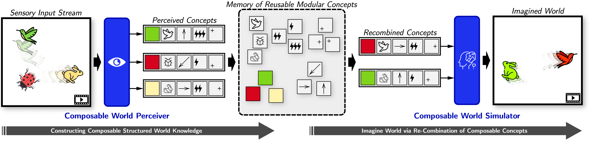

# Dreamweaver: Learning Compositional World Models from Pixels 
Author: Junyeob Baek, Yi-Fu Wu, Gautam Singh, Sungjin Ahn

**_Published to ICLR 2025_**

[[paper]](https://arxiv.org/abs/2501.14174) [[project]](https://cun-bjy.github.io/dreamweaver-website/) [[openreview]](https://openreview.net/forum?id=e5mTvjXG9u&referrer=%5BAuthor%20Console%5D(%2Fgroup%3Fid%3DICLR.cc%2F2025%2FConference%2FAuthors%23your-submissions))

## Overview


## Hightlighted Demo


## Installation
```bash
git clone https://github.com/ahn-ml/dreamweaver-release.git
cd dreamweaver-release
pip install -r requirements.txt
```

### How to Train
```python
bash train.sh # run this first for sanity-check and change the hyperparameters appropreately
```


## Citation
```bibtex
@inproceedings{
        baek2025dreamweaver,
        title={Dreamweaver: Learning Compositional World Models from Pixels},
        author={Junyeob Baek and Yi-Fu Wu and Gautam Singh and Sungjin Ahn},
        booktitle={The Thirteenth International Conference on Learning Representations},
        year={2025},
        url={https://openreview.net/forum?id=e5mTvjXG9u}
        }
```

## Acknowledgements
Some modules in this code are referenced by [singhgautam/sysbinder](https://github.com/singhgautam/sysbinder). We thank the authors for their great works!